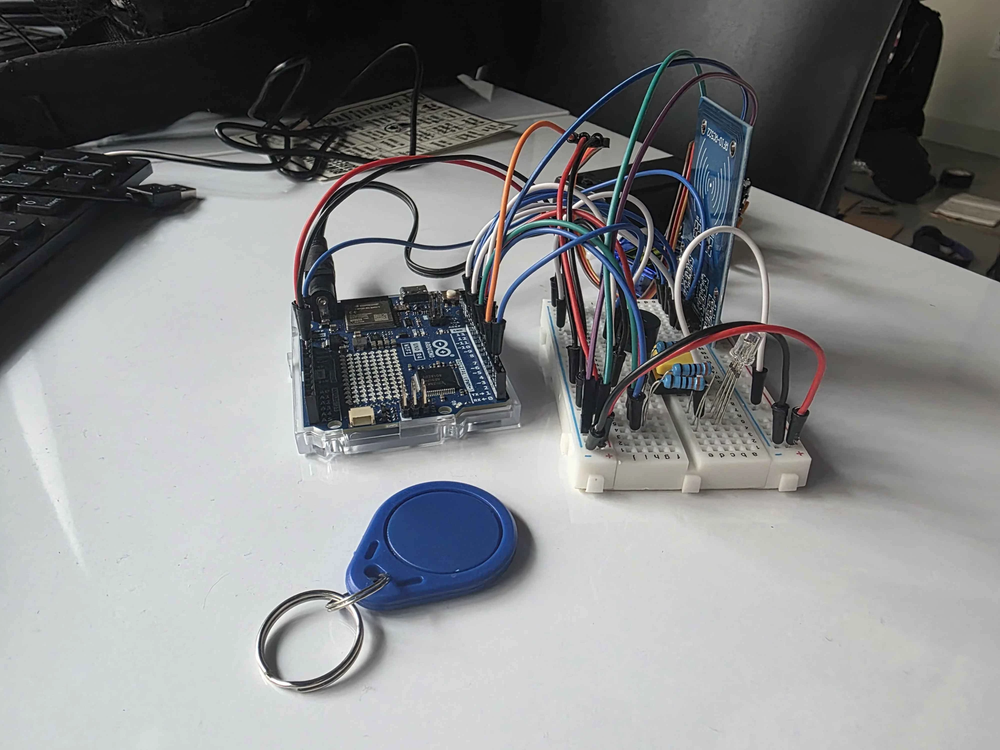
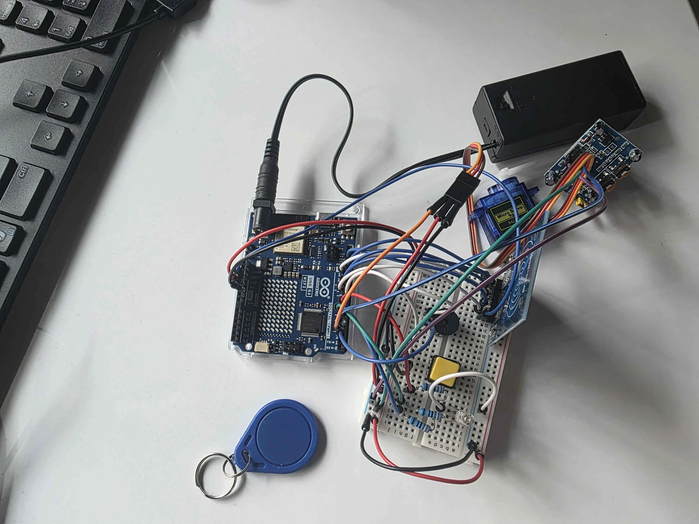
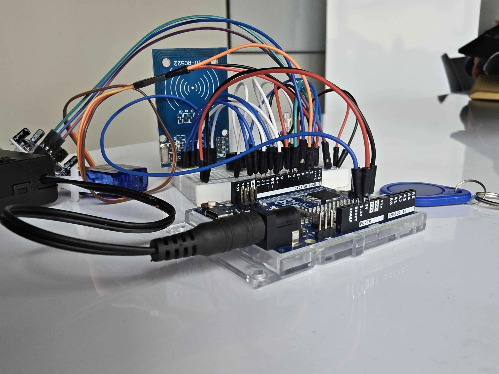

# M&N Vault

A combination-locked vault box built for **Rowdy Hacks** on an **Arduino UNO R4 WiFi**. It only opens after the right sequence of button presses, a wave at a motion sensor and an RFID scan, and it sends a **Telegram** message to the owner whenever it opens or someone fails an attempt.



## How it works

The user picks a color with the push button, then proves themselves with the motion sensor and an RFID tag.

| Button presses | Color | What happens |
|---|---|---|
| 1 | Red | Wave at the PIR sensor, then scan the RFID tag: **vault opens** |
| 2 | Green | Decoy path. Any wave, or waiting 5 seconds, **sounds the alarm** |
| 3 | Blue | Wave at the PIR sensor, then scan the RFID tag: **vault opens** |
| 4 or more | n/a | Alarm |

- The RGB LED shows the color currently selected.
- Each step has a 5 second timeout. Missing it triggers the alarm.
- **Success:** victory tones, the servo turns 90° to unlock, stays open for 30 seconds, then re-locks.
- **Failure:** two-tone siren from the buzzer.
- **Notifications:** Telegram messages such as `Vault OPENED (RED combo)` and `Vault ALARM: wrong combination (green)`.

## Hardware

All parts are from the SunFounder Elite Explorer kit.

- Arduino UNO R4 WiFi (its ESP32-S3 module handles WiFi)
- MFRC522 RFID reader and key-fob tag
- HC-SR501 PIR motion sensor
- Push button
- RGB LED with three resistors
- Buzzer
- SG90 micro servo (the lock)
- Breadboard and jumper wires
- 9V battery pack on the barrel jack (USB-C also works)



### Pin mapping

| Part | Arduino pin |
|---|---|
| RFID SDA (SS) | D10 |
| RFID SCK | D13 |
| RFID MOSI | D11 |
| RFID MISO | D12 |
| RFID RST | D9 |
| RFID 3.3V / GND | 3.3V / GND (**never 5V**) |
| RFID IRQ | not connected (optional pin) |
| RGB LED red / green / blue | D7 / D6 / D5 |
| Push button | D8 (other leg to GND, internal pull-up) |
| PIR motion sensor | D4 |
| Servo | D3 |
| Buzzer | D2 |



## Getting started

1. Install the [Arduino IDE](https://www.arduino.cc/en/software), then through Boards Manager install **Arduino UNO R4 Boards**.
2. In Library Manager install **MFRC522** (the architecture warning for the R4 can be ignored). `Servo` and `WiFiS3` come with the board package.
3. Copy `firmware/Vault/arduino_secrets.example.h` to `firmware/Vault/arduino_secrets.h` and fill in your values. This file is git-ignored and must never be committed.
4. Open `firmware/Vault/Vault.ino`, select **Arduino UNO R4 WiFi** and your port, and upload.
5. Open the Serial Monitor at **9600 baud**. A successful text shows `Telegram: sent`.

### Telegram setup

1. In Telegram, message **@BotFather**, send `/newbot`, and follow the prompts. It gives you a **bot token**.
2. Open your new bot and send it any message.
3. In a browser open `https://api.telegram.org/bot<YOUR_TOKEN>/getUpdates` and find `"chat":{"id":` followed by a number. That is your **chat ID**.
4. Put both in `arduino_secrets.h`.

The board needs a **2.4 GHz** WiFi network. Guest networks with a login page will connect but cannot reach Telegram; a phone hotspot works well.

## Project structure

```
M-N-Vault/
├── firmware/Vault/
│   ├── Vault.ino                    # main sketch
│   └── arduino_secrets.example.h    # copy to arduino_secrets.h
├── docs/images/                     # build photos
├── LICENSE
└── README.md
```

## Known limitations and next steps

- Any RFID tag currently unlocks the vault. Next step: store and check specific card UIDs.
- Sending a Telegram message blocks the sketch for a few seconds.
- A 9V battery only lasts a few hours with WiFi on; a USB power bank is better for long use.
- Ideas: a daily-changing combination, a photoresistor step, a 3D-printed enclosure.

## License

[MIT](LICENSE)
